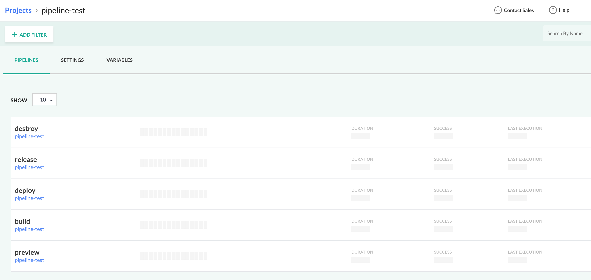

# Codefresh Pipeline Specs

## Install Codefresh CLI

Refer to [Codefresh CLI installation](https://codefresh-io.github.io/cli/installation) for more details.

__NOTE:__ If you are running the Docker container using the [Dockerfile](../Dockerfile), Codefresh CLI is already installed.

```sh
npm install -g codefresh
```

## Generate Codefresh API Key

In Codefresh, create an API key by going to your [User settings](https://g.codefresh.io/user/settings), then clicking the "GENERATE" button under the "API Keys" section.

Use the following scopes for the API Key:

- Pipeline: `read`, `write`
- Project: `read`, `write`

<br>

Refer to [Authentication in Codefresh CLI](https://codefresh.io/codefresh-news/introducing-codefresh-cli) for more details.

## Authenticate

Create Codefresh login context by executing this command:

```sh
codefresh auth create-context --api-key XXXXXXXXXXXXXXX.YYYYYYYYYYYYYYYYYYYYYYYYYYYYYY
```

__NOTE:__ Replace `XXXXXXXXXXXXXXX.YYYYYYYYYYYYYYYYYYYYYYYYYYYYYY` with the API Key created in the previous step.

To check if you have successfully authenticated to Codefresh, run the following commands:

```sh
codefresh get pipelines
codefresh get projects
```

## Get existing pipelines specs

```sh
codefresh get pipeline example-app/preview -o yaml > preview-spec.yaml
codefresh get pipeline example-app/destroy -o yaml > destroy-spec.yaml
codefresh get pipeline example-app/build -o yaml > build-spec.yaml
codefresh get pipeline example-app/deploy -o yaml > deploy-spec.yaml
codefresh get pipeline example-app/release -o yaml > release-spec.yaml
```

## Create pipelines

### Create new project

```sh
codefresh create project pipeline-test
```


### Create new pipelines

```sh
codefresh create pipeline -f preview-spec.yaml
codefresh create pipeline -f destroy-spec.yaml
codefresh create pipeline -f build-spec.yaml
codefresh create pipeline -f deploy-spec.yaml
codefresh create pipeline -f release-spec.yaml
```

<details><summary>Show details</summary>

<br>



</details>

<br>
